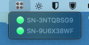
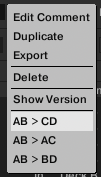

# X1 Mk1 USB2MIDI

[](https://github.com/Opa-/x1-mk1-usb2midi/actions/workflows/rust.yml)

<a href='https://ko-fi.com/opa_sdc' target='_blank'>

Native Instruments discontinued the support for the Traktor Kontrol X1 MK1 since MacOS Catalina [see here](https://support.native-instruments.com/hc/en-us/articles/360014900358-Compatibility-of-Native-Instruments-Products-on-macOS). This means that the controller is not recognized by MacOS nor Traktor anymore and it's not possible to use it as a MIDI controller because Native Instruments doesn't want to develop a proper driver.

Note that a nicer way of doing this would be to develop a real driver. But in order to use Apple's [DriverKit](https://developer.apple.com/documentation/driverkit), you need to enroll for Apple Developer Program for $99 a year. 

This program aims to :poop: on NI's planned obsolescence and expensive Apple Dev Program by providing a way to use the X1 MK1 as a MIDI controller with the software of your choice.

Thanks to @joherold repository for all the findings [joherold/traktor_x1](https://github.com/joherold/traktor_x1)

> Disclaimer: This is my first Rust program, use at your own risks :)

So far, it has been tested with 2 X1 MK1 against Traktor Pro 3.11.0 44 on a Apple M2 Pro running MacOS Ventura 13.6.4 (22G513).

## Install (macOS)

Grab the [latest release](https://github.com/Opa-/x1-mk1-usb2midi/releases/latest) and run the App, it should launch in the Dock and you should have an icon in the menu bar as well, listing all currently connected X1 Mk1.

> The first time you run the app, macOS will not run it, saying it's from an unidentified developer. You need to go in System Settings > Privacy & Security, scroll down and click "Open Anyway".



A basic mapping is also available on the release page `DeckAB.tsi`. You can import it into Traktor (created with Traktor 3, not sure about Traktor 2 compatibility). The application creates virtual MIDI ports using the serial number of the controller as the name so you should put it as both `Input` and `Output` like this :


If you need additional controller, just duplicate the device, assign the `In-Port` & `Out-Port` to the other X1 Mk1 serial number and click on `Edit` -> `AB > CD` to convert the mapping :
| Section   | Deck/FX Unit | Type           | Interaction     | Label      | MIDI in     | MIDI out    | Label 2               | MIDI w. Shift in | Color  |
| --------- | ------------ | -------------- | --------------- | ---------- | ----------- | ----------- | --------------------- | ---------------- | ------ |
| Decks     | Global       | Button         | Hold            | Shift      | Ch01.CC.045 | n/a         | n/a                   | n/a              | n/a    |
| Hotcue    | Global       | Button         | Toggle          | Hotcue     | Ch01.CC.046 | n/a         | n/a                   | n/a              | Green  |
|           |              |                |                 |            |             |             |                       |                  |        |
| FX        | 1            | Button         | Toggle          | ON         | Ch01.CC.008 | Ch03.CC.008 | Select next FX        | Ch02.CC.008      | Orange |
| FX        | 1            | Encoder        | Direct/Relative | Dry/Wet    | Ch01.CC.000 | n/a         | n/a                   | Ch02.CC.000      | n/a    |
| FX        | 1            | Button         | Toggle          | Button 1   | Ch01.CC.010 | Ch03.CC.007 | Delay                 | Ch02.CC.010      | Orange |
| FX        | 1            | Encoder        | Direct/Relative | 1          | Ch01.CC.002 | n/a         | n/a                   | Ch02.CC.002      | n/a    |
| FX        | 1            | Button         | Toggle          | Button 2   | Ch01.CC.012 | Ch03.CC.006 | Reverb                | Ch02.CC.012      | Orange |
| FX        | 1            | Encoder        | Direct/Relative | 2          | Ch01.CC.004 | n/a         | n/a                   | Ch02.CC.004      | n/a    |
| FX        | 1            | Button         | Toggle          | Button 3   | Ch01.CC.014 | Ch03.CC.005 | Filter                | Ch02.CC.014      | Orange |
| FX        | 1            | Encoder        | Direct/Relative | 3          | Ch01.CC.006 | n/a         | n/a                   | Ch02.CC.006      | n/a    |
|           |              |                |                 |            |             |             |                       |                  |        |
| Decks     | A            | Ecoder         | Direct/Relative | Browse     | Ch01.CC.016 | n/a         | Seek                  | Ch02.CC.016      | n/a    |
| Decks     | A            | Encoder Button | Trigger         | Load       | Ch01.CC.018 | n/a         | View                  | Ch02.CC.018      | n/a    |
| Decks     | A            | Button         | Toggle          | FX1        | Ch01.CC.020 | Ch03.CC.025 | Master                | Ch02.CC.020      | Orange |
| Decks     | A            | Button         | Toggle          | FX2        | Ch01.CC.022 | Ch03.CC.026 | Snap                  | Ch02.CC.022      | Orange |
|           |              |                |                 |            |             |             |                       |                  |        |
| Loop      | A            | Ecoder         | Direct/Relative | Size       | Ch01.CC.026 | n/a         | Move                  | Ch02.CC.026      | n/a    |
| Loop      | A            | Encoder Button | Trigger         | Loop       | Ch01.CC.024 | n/a         | Act. Next Stored Loop | Ch02.CC.024      | n/a    |
| Loop      | A            | Button         | Toggle          | In         | Ch01.CC.028 | Ch03.CC.018 | \-                    | Ch02.CC.028      | Blue   |
| Loop      | A            | Button         | Toggle          | Out        | Ch01.CC.030 | Ch03.CC.017 | +                     | Ch02.CC.030      | Blue   |
|           |              |                |                 |            |             |             |                       |                  |        |
| Transport | A            | Button         | Hold            | <- Beat    | Ch01.CC.032 | Ch03.CC.019 | Bend left             | Ch02.CC.032      | Blue   |
| Transport | A            | Button         | Hold            | Beat ->    | Ch01.CC.034 | Ch03.CC.020 | Bend right            | Ch02.CC.034      | Blue   |
| Transport | A            | Button         | Toggle          | Cue \| Rel | Ch01.CC.036 | Ch03.CC.022 | Back to start         | Ch02.CC.036      | Blue   |
| Transport | A            | Button         | Toggle          | Cup \| Abs | Ch01.CC.038 | Ch03.CC.021 | Skip to next cue      | Ch02.CC.038      | Blue   |
| Transport | A            | Button         | Toggle          | Play       | Ch01.CC.040 | Ch03.CC.024 | Key                   | Ch02.CC.040      | Blue   |
| Transport | A            | Button         | Toggle          | Sync       | Ch01.CC.042 | Ch03.CC.023 | Tap                   | Ch02.CC.042      | Blue   |
|           |              |                |                 |            |             |             |                       |                  |        |
| Hotcue    | A            | Button         | Toggle          | 1          | Ch04.CC.009 | Ch04.CC.009 | n/a                   | Ch05.CC.009      | Blue   |
| Hotcue    | A            | Button         | Toggle          | 2          | Ch04.CC.011 | Ch04.CC.011 | n/a                   | Ch05.CC.011      | Blue   |
| Hotcue    | A            | Button         | Toggle          | 3          | Ch04.CC.013 | Ch04.CC.013 | n/a                   | Ch05.CC.013      | Blue   |
| Hotcue    | A            | Button         | Toggle          | 4          | Ch04.CC.015 | Ch04.CC.015 | n/a                   | Ch05.CC.015      | Blue   |
| Hotcue    | A            | Button         | Toggle          | 5          | Ch04.CC.008 | Ch04.CC.008 | n/a                   | Ch05.CC.008      | Blue   |
| Hotcue    | A            | Button         | Toggle          | 6          | Ch04.CC.010 | Ch04.CC.010 | n/a                   | Ch05.CC.010      | Blue   |
| Hotcue    | A            | Button         | Toggle          | 7          | Ch04.CC.012 | Ch04.CC.012 | n/a                   | Ch05.CC.012      | Blue   |
| Hotcue    | A            | Button         | Toggle          | 8          | Ch04.CC.014 | Ch04.CC.014 | n/a                   | Ch05.CC.014      | Blue   |
|           |              |                |                 |            |             |             |                       |                  |        |
| FX        | 2            | Button         | Toggle          | ON         | Ch01.CC.009 | Ch03.CC.004 | Select next FX        | Ch02.CC.008      | Orange |
| FX        | 2            | Encoder        | Direct/Relative | Dry/Wet    | Ch01.CC.001 | n/a         | n/a                   |                  | n/a    |
| FX        | 2            | Button         | Toggle          | Button 1   | Ch01.CC.011 | Ch03.CC.003 | Delay                 | Ch02.CC.010      | Orange |
| FX        | 2            | Encoder        | Direct/Relative | 1          | Ch01.CC.003 | n/a         | n/a                   |                  | n/a    |
| FX        | 2            | Button         | Toggle          | Button 2   | Ch01.CC.013 | Ch03.CC.002 | Reverb                | Ch02.CC.012      | Orange |
| FX        | 2            | Encoder        | Direct/Relative | 2          | Ch01.CC.005 | n/a         | n/a                   |                  | n/a    |
| FX        | 2            | Button         | Toggle          | Button 3   | Ch01.CC.015 | Ch03.CC.001 | Filter                | Ch02.CC.014      | Orange |
| FX        | 2            | Encoder        | Direct/Relative | 3          | Ch01.CC.007 | n/a         | n/a                   |                  | n/a    |
|           |              |                |                 |            |             |             |                       |                  |        |
| Decks     | B            | Ecoder         | Direct/Relative | Browse     | Ch01.CC.017 | n/a         | Seek                  | Ch02.CC.017      | n/a    |
| Decks     | B            | Encoder Button | Trigger         | Load       | Ch01.CC.019 | n/a         | View                  | Ch02.CC.019      | n/a    |
| Decks     | B            | Button         | Toggle          | FX1        | Ch01.CC.021 | Ch03.CC.027 | Master                | Ch02.CC.021      | Orange |
| Decks     | B            | Button         | Toggle          | FX2        | Ch01.CC.023 | Ch03.CC.028 | Quant                 | Ch02.CC.023      | Orange |
|           |              |                |                 |            |             |             |                       |                  |        |
| Loop      | B            | Ecoder         | Direct/Relative | Size       | Ch01.CC.027 | n/a         | Move                  | Ch02.CC.027      | n/a    |
| Loop      | B            | Encoder Button | Trigger         | Loop       | Ch01.CC.025 | n/a         | Act. Next Stored Loop | Ch02.CC.025      | n/a    |
| Loop      | B            | Button         | Toggle          | In         | Ch01.CC.029 | Ch03.CC.016 | \-                    | Ch02.CC.029      | Blue   |
| Loop      | B            | Button         | Toggle          | Out        | Ch01.CC.031 | Ch03.CC.015 | +                     | Ch02.CC.031      | Blue   |
|           |              |                |                 |            |             |             |                       |                  |        |
| Transport | B            | Button         | Hold            | <- Beat    | Ch01.CC.033 | Ch03.CC.013 | Bend left             | Ch02.CC.033      | Blue   |
| Transport | B            | Button         | Hold            | Beat ->    | Ch01.CC.035 | Ch03.CC.014 | Bend right            | Ch02.CC.035      | Blue   |
| Transport | B            | Button         | Toggle          | Cue \| Rel | Ch01.CC.037 | Ch03.CC.012 | Back to start         | Ch02.CC.037      | Blue   |
| Transport | B            | Button         | Toggle          | Cup \| Abs | Ch01.CC.039 | Ch03.CC.011 | Skip to next cue      | Ch02.CC.039      | Blue   |
| Transport | B            | Button         | Toggle          | Play       | Ch01.CC.041 | Ch03.CC.010 | Key                   | Ch02.CC.041      | Blue   |
| Transport | B            | Button         | Toggle          | Sync       | Ch01.CC.043 | Ch03.CC.009 | Tap                   | Ch02.CC.043      | Blue   |
|           |              |                |                 |            |             |             |                       |                  |        |
| Hotcue    | B            | Button         | Toggle          | 1          | Ch04.CC.009 | Ch04.CC.007 | n/a                   | Ch05.CC.009      | Blue   |
| Hotcue    | B            | Button         | Toggle          | 2          | Ch04.CC.011 | Ch04.CC.005 | n/a                   | Ch05.CC.011      | Blue   |
| Hotcue    | B            | Button         | Toggle          | 3          | Ch04.CC.013 | Ch04.CC.003 | n/a                   | Ch05.CC.013      | Blue   |
| Hotcue    | B            | Button         | Toggle          | 4          | Ch04.CC.015 | Ch04.CC.001 | n/a                   | Ch05.CC.015      | Blue   |
| Hotcue    | B            | Button         | Toggle          | 5          | Ch04.CC.008 | Ch04.CC.006 | n/a                   | Ch05.CC.008      | Blue   |
| Hotcue    | B            | Button         | Toggle          | 6          | Ch04.CC.010 | Ch04.CC.004 | n/a                   | Ch05.CC.010      | Blue   |
| Hotcue    | B            | Button         | Toggle          | 7          | Ch04.CC.012 | Ch04.CC.002 | n/a                   | Ch05.CC.012      | Blue   |
| Hotcue    | B            | Button         | Toggle          | 8          | Ch04.CC.014 | Ch04.CC.000 | n/a                   | Ch05.CC.014      | Blue   |


Here's [a video](https://streamable.com/ziu6pa) if needed for the later step.

If you want to do your own mapping, you can simply use the "Learn" feature of Traktor and click on the buttons 😉

**🫵 Your feedback is essential to enhance/fix this app. Feel free to report any feedback or any issue you could encounter in the [discussions tab](https://github.com/Opa-/x1-mk1-usb2midi/discussions) or the [issues tab](https://github.com/Opa-/x1-mk1-usb2midi/issues).**

## Install (Linux)

This tool can be used to run the X1 MK1 with Linux.
It has been successfully tested with [Mixxx](https://mixxx.org).
In Linux, this tool does not have a GUI, yet.

* Clone this repository
* Make sure you have installed the [libusb](https://libusb.info/) headers which are necessary for the [rusb](https://github.com/a1ien/rusb) crate. On OpenSUSE Tumbleweed the necessary package was `libusb-devel`.
* Put the following line in a new udev rule, e.g. in `/etc/udev/rules.d/99-x1mk1.rules` so you can access the device without needing to run this as root and also to unload the caiaq driver.
```
SUBSYSTEMS=="usb", ATTRS{idVendor}=="17cc", ATTRS{idProduct}=="2305", ACTION=="add", DRIVER=="snd-usb-caiaq", MODE="0666", RUN+="/bin/sh -c 'echo $kernel > /sys/bus/usb/drivers/snd-usb-caiaq/unbind'"
```
* Build and run with `cargo run`
* Startup Mixxx, it should detect the device, select the X1 mappings (which are not perfectly great yet).


## Known issues

- The `<| BEAT` and `BEAT |>` buttons can only be used as "Hold" button types. All other buttons can only be used as "Toggle" button types.

## Features

- [x] No limit on the number of controllers
- [x] Hotplug support
- [x] LED support
- [x] SHIFT button support
- [X] HOTCUE button support
- [X] macOS menu bar integration

## MIDI mapping overview

| Section   | Deck/FX Unit | Type           | Interaction     | Label      | MIDI in     | MIDI out    | Label 2               | MIDI w. Shift in | Color  |
| --------- | ------------ | -------------- | --------------- | ---------- | ----------- | ----------- | --------------------- | ---------------- | ------ |
| Decks     | Global       | Button         | Hold            | Shift      | Ch01.CC.045 | n/a         | n/a                   | n/a              | n/a    |
| Hotcue    | Global       | Button         | Toggle          | Hotcue     | Ch01.CC.046 | n/a         | n/a                   | n/a              | Green  |
|           |              |                |                 |            |             |             |                       |                  |        |
| FX        | 1            | Button         | Toggle          | ON         | Ch01.CC.008 | Ch03.CC.008 | Select next FX        | Ch02.CC.008      | Orange |
| FX        | 1            | Encoder        | Direct/Relative | Dry/Wet    | Ch01.CC.000 | n/a         | n/a                   | Ch02.CC.000      | n/a    |
| FX        | 1            | Button         | Toggle          | Button 1   | Ch01.CC.010 | Ch03.CC.007 | Delay                 | Ch02.CC.010      | Orange |
| FX        | 1            | Encoder        | Direct/Relative | 1          | Ch01.CC.002 | n/a         | n/a                   | Ch02.CC.002      | n/a    |
| FX        | 1            | Button         | Toggle          | Button 2   | Ch01.CC.012 | Ch03.CC.006 | Reverb                | Ch02.CC.012      | Orange |
| FX        | 1            | Encoder        | Direct/Relative | 2          | Ch01.CC.004 | n/a         | n/a                   | Ch02.CC.004      | n/a    |
| FX        | 1            | Button         | Toggle          | Button 3   | Ch01.CC.014 | Ch03.CC.005 | Filter                | Ch02.CC.014      | Orange |
| FX        | 1            | Encoder        | Direct/Relative | 3          | Ch01.CC.006 | n/a         | n/a                   | Ch02.CC.006      | n/a    |
|           |              |                |                 |            |             |             |                       |                  |        |
| Decks     | A            | Ecoder         | Direct/Relative | Browse     | Ch01.CC.016 | n/a         | Seek                  | Ch02.CC.016      | n/a    |
| Decks     | A            | Encoder Button | Trigger         | Load       | Ch01.CC.018 | n/a         | View                  | Ch02.CC.018      | n/a    |
| Decks     | A            | Button         | Toggle          | FX1        | Ch01.CC.020 | Ch03.CC.025 | Master                | Ch02.CC.020      | Orange |
| Decks     | A            | Button         | Toggle          | FX2        | Ch01.CC.022 | Ch03.CC.026 | Snap                  | Ch02.CC.022      | Orange |
|           |              |                |                 |            |             |             |                       |                  |        |
| Loop      | A            | Ecoder         | Direct/Relative | Size       | Ch01.CC.026 | n/a         | Move                  | Ch02.CC.026      | n/a    |
| Loop      | A            | Encoder Button | Trigger         | Loop       | Ch01.CC.024 | n/a         | Act. Next Stored Loop | Ch02.CC.024      | n/a    |
| Loop      | A            | Button         | Toggle          | In         | Ch01.CC.028 | Ch03.CC.018 | \-                    | Ch02.CC.028      | Blue   |
| Loop      | A            | Button         | Toggle          | Out        | Ch01.CC.030 | Ch03.CC.017 | +                     | Ch02.CC.030      | Blue   |
|           |              |                |                 |            |             |             |                       |                  |        |
| Transport | A            | Button         | Hold            | <- Beat    | Ch01.CC.032 | Ch03.CC.019 | Bend left             | Ch02.CC.032      | Blue   |
| Transport | A            | Button         | Hold            | Beat ->    | Ch01.CC.034 | Ch03.CC.020 | Bend right            | Ch02.CC.034      | Blue   |
| Transport | A            | Button         | Toggle          | Cue \| Rel | Ch01.CC.036 | Ch03.CC.022 | Back to start         | Ch02.CC.036      | Blue   |
| Transport | A            | Button         | Toggle          | Cup \| Abs | Ch01.CC.038 | Ch03.CC.021 | Skip to next cue      | Ch02.CC.038      | Blue   |
| Transport | A            | Button         | Toggle          | Play       | Ch01.CC.040 | Ch03.CC.024 | Key                   | Ch02.CC.040      | Blue   |
| Transport | A            | Button         | Toggle          | Sync       | Ch01.CC.042 | Ch03.CC.023 | Tap                   | Ch02.CC.042      | Blue   |
|           |              |                |                 |            |             |             |                       |                  |        |
| Hotcue    | A            | Button         | Toggle          | 1          | Ch04.CC.009 | Ch04.CC.009 | n/a                   | Ch05.CC.009      | Blue   |
| Hotcue    | A            | Button         | Toggle          | 2          | Ch04.CC.011 | Ch04.CC.011 | n/a                   | Ch05.CC.011      | Blue   |
| Hotcue    | A            | Button         | Toggle          | 3          | Ch04.CC.013 | Ch04.CC.013 | n/a                   | Ch05.CC.013      | Blue   |
| Hotcue    | A            | Button         | Toggle          | 4          | Ch04.CC.015 | Ch04.CC.015 | n/a                   | Ch05.CC.015      | Blue   |
| Hotcue    | A            | Button         | Toggle          | 5          | Ch04.CC.008 | Ch04.CC.008 | n/a                   | Ch05.CC.008      | Blue   |
| Hotcue    | A            | Button         | Toggle          | 6          | Ch04.CC.010 | Ch04.CC.010 | n/a                   | Ch05.CC.010      | Blue   |
| Hotcue    | A            | Button         | Toggle          | 7          | Ch04.CC.012 | Ch04.CC.012 | n/a                   | Ch05.CC.012      | Blue   |
| Hotcue    | A            | Button         | Toggle          | 8          | Ch04.CC.014 | Ch04.CC.014 | n/a                   | Ch05.CC.014      | Blue   |
|           |              |                |                 |            |             |             |                       |                  |        |
| FX        | 2            | Button         | Toggle          | ON         | Ch01.CC.009 | Ch03.CC.004 | Select next FX        | Ch02.CC.008      | Orange |
| FX        | 2            | Encoder        | Direct/Relative | Dry/Wet    | Ch01.CC.001 | n/a         | n/a                   |                  | n/a    |
| FX        | 2            | Button         | Toggle          | Button 1   | Ch01.CC.011 | Ch03.CC.003 | Delay                 | Ch02.CC.010      | Orange |
| FX        | 2            | Encoder        | Direct/Relative | 1          | Ch01.CC.003 | n/a         | n/a                   |                  | n/a    |
| FX        | 2            | Button         | Toggle          | Button 2   | Ch01.CC.013 | Ch03.CC.002 | Reverb                | Ch02.CC.012      | Orange |
| FX        | 2            | Encoder        | Direct/Relative | 2          | Ch01.CC.005 | n/a         | n/a                   |                  | n/a    |
| FX        | 2            | Button         | Toggle          | Button 3   | Ch01.CC.015 | Ch03.CC.001 | Filter                | Ch02.CC.014      | Orange |
| FX        | 2            | Encoder        | Direct/Relative | 3          | Ch01.CC.007 | n/a         | n/a                   |                  | n/a    |
|           |              |                |                 |            |             |             |                       |                  |        |
| Decks     | B            | Ecoder         | Direct/Relative | Browse     | Ch01.CC.017 | n/a         | Seek                  | Ch02.CC.017      | n/a    |
| Decks     | B            | Encoder Button | Trigger         | Load       | Ch01.CC.019 | n/a         | View                  | Ch02.CC.019      | n/a    |
| Decks     | B            | Button         | Toggle          | FX1        | Ch01.CC.021 | Ch03.CC.027 | Master                | Ch02.CC.021      | Orange |
| Decks     | B            | Button         | Toggle          | FX2        | Ch01.CC.023 | Ch03.CC.028 | Quant                 | Ch02.CC.023      | Orange |
|           |              |                |                 |            |             |             |                       |                  |        |
| Loop      | B            | Ecoder         | Direct/Relative | Size       | Ch01.CC.027 | n/a         | Move                  | Ch02.CC.027      | n/a    |
| Loop      | B            | Encoder Button | Trigger         | Loop       | Ch01.CC.025 | n/a         | Act. Next Stored Loop | Ch02.CC.025      | n/a    |
| Loop      | B            | Button         | Toggle          | In         | Ch01.CC.029 | Ch03.CC.016 | \-                    | Ch02.CC.029      | Blue   |
| Loop      | B            | Button         | Toggle          | Out        | Ch01.CC.031 | Ch03.CC.015 | +                     | Ch02.CC.031      | Blue   |
|           |              |                |                 |            |             |             |                       |                  |        |
| Transport | B            | Button         | Hold            | <- Beat    | Ch01.CC.033 | Ch03.CC.013 | Bend left             | Ch02.CC.033      | Blue   |
| Transport | B            | Button         | Hold            | Beat ->    | Ch01.CC.035 | Ch03.CC.014 | Bend right            | Ch02.CC.035      | Blue   |
| Transport | B            | Button         | Toggle          | Cue \| Rel | Ch01.CC.037 | Ch03.CC.012 | Back to start         | Ch02.CC.037      | Blue   |
| Transport | B            | Button         | Toggle          | Cup \| Abs | Ch01.CC.039 | Ch03.CC.011 | Skip to next cue      | Ch02.CC.039      | Blue   |
| Transport | B            | Button         | Toggle          | Play       | Ch01.CC.041 | Ch03.CC.010 | Key                   | Ch02.CC.041      | Blue   |
| Transport | B            | Button         | Toggle          | Sync       | Ch01.CC.043 | Ch03.CC.009 | Tap                   | Ch02.CC.043      | Blue   |
|           |              |                |                 |            |             |             |                       |                  |        |
| Hotcue    | B            | Button         | Toggle          | 1          | Ch04.CC.009 | Ch04.CC.007 | n/a                   | Ch05.CC.009      | Blue   |
| Hotcue    | B            | Button         | Toggle          | 2          | Ch04.CC.011 | Ch04.CC.005 | n/a                   | Ch05.CC.011      | Blue   |
| Hotcue    | B            | Button         | Toggle          | 3          | Ch04.CC.013 | Ch04.CC.003 | n/a                   | Ch05.CC.013      | Blue   |
| Hotcue    | B            | Button         | Toggle          | 4          | Ch04.CC.015 | Ch04.CC.001 | n/a                   | Ch05.CC.015      | Blue   |
| Hotcue    | B            | Button         | Toggle          | 5          | Ch04.CC.008 | Ch04.CC.006 | n/a                   | Ch05.CC.008      | Blue   |
| Hotcue    | B            | Button         | Toggle          | 6          | Ch04.CC.010 | Ch04.CC.004 | n/a                   | Ch05.CC.010      | Blue   |
| Hotcue    | B            | Button         | Toggle          | 7          | Ch04.CC.012 | Ch04.CC.002 | n/a                   | Ch05.CC.012      | Blue   |
| Hotcue    | B            | Button         | Toggle          | 8          | Ch04.CC.014 | Ch04.CC.000 | n/a                   | Ch05.CC.014      | Blue   |

## Roadmap

- [x] Linux
- [ ] Windows 11
- [ ] GUI configuration

# Contributing

Feel free to contribute to the project by posting an issue, a thread in the discussions tab or directly a PR.

## Development Requirements

- [libusb](https://libusb.info/) (Tested with 1.0.27)
